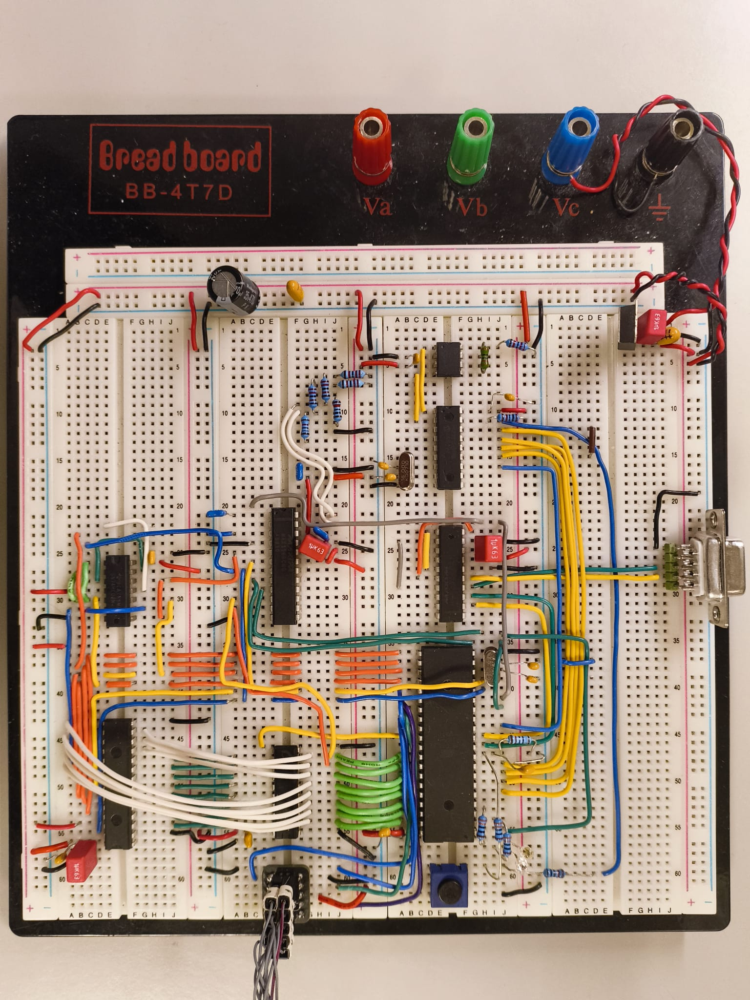
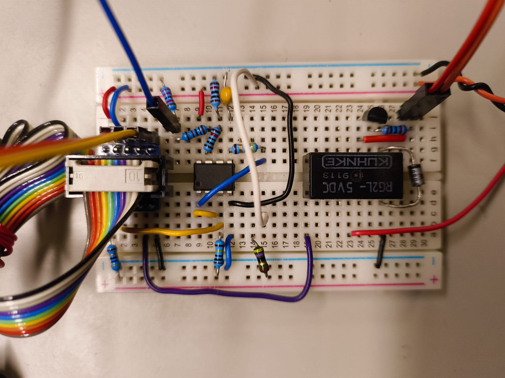

# [TTK4155 - Embedded and Industrial Computer Systems Design](http://www.ntnu.edu/studies/courses/TTK4155)

## Team
-Alberto Morselli https://github.com/albertomors \
-Sergio Pisoni https://github.com/SPiso3 \
-Adrià Espiell Chaler

August - December 2024

## Course content
Design of embedded computer systems. Computer architectures and system components for embedded and industrial applications. Microcontrollers and specialized microprocessors. Parallel and serial bus systems. Data communication in industrial environments. Analog/digital interfaces.

## Project
In this course, we had a large term project where we created a computer controller electromechanical ping pong game. The main challenge was to assemble the hardware components and develop the software for the microcontrollers, making a fully functional embedded computer system that enabled us to play a refreshing game of ping pong! The project was divided into nine parts, that we did more-or-less on a week-to-week basis: 

  - **Part 1** - Initial assembly of microcontroller and RS-232
  - **Part 2** - Address decoding and external RAM
  - **Part 3** - A/D converting and joystick input
  - **Part 4** - OLED display and user interface
  - **Part 5** - SPI and CAN controller
  - **Part 6** - CAN-bus and communication between nodes
  - **Part 7** - Controlling servo and IR
  - **Part 8** - Controlling motor and solenoid
  - **Part 9** - Completion of the project

## Structure

```
maglev22/
├── project files     # Atmel Studio project files
├── res               # Just some pictures 
├── source code       # C source code
    ├── node 1        # atmega162
    └── node 2        # atsam3x8e
├── LICENSE           # License information
└── README.md         # Project documentation
```

## Pictures

<div style="display: flex; justify-content: center; gap: 10px;">
  
</p>
<div style="display: flex; justify-content: center; gap: 10px;">
  
</p>

## License

This project is licensed under the MIT License. See the [LICENSE](LICENSE) file for more details.
